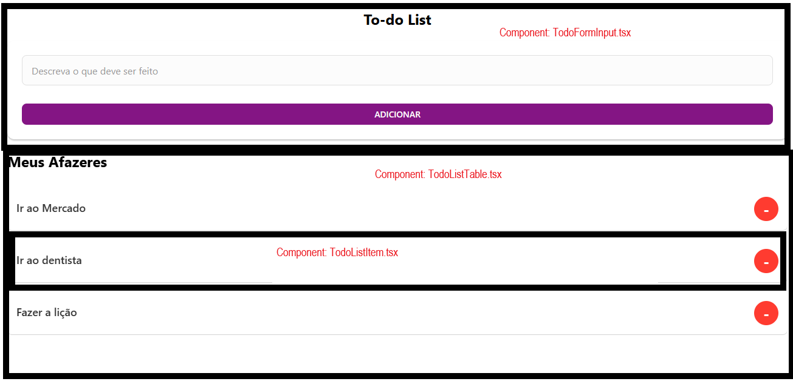

# <h1> TO-DO-LIST-REACT-NATIVVE

<p>
  
</p>

## Sobre
CRUD com Async Storage e React Native de lista TO-DO.
Projeto Componentizado e utilizando React Hooks para gerenciar alguns estados locais, mas a logica de negocio do APP se encontra em um provider do Context API em que se encontra as funções de: Criar To-do, Atualizar To-do, Listar To-do e Remover To-do;
A persistencia de dados  foi feita por AsyncStorage pela facilidade de integração visto que é nativo do android mas que pessoalmente eu prefiro o uso do SQLite devido a ter mais familiaridade com SQL na questão de gerenciamento de dados;
Não utilizei nenhuma LIB de estilização e ficando apenas no Styled-Components simples.
ESLint para identação do código seguindo o padrão prório do ESLint.
Utilizei o JEST com o RNTL para os testes unitários fazendo tudo em uma branch separada sem merge com DEVELOP pois não fiquei seguro o suficiente visto que só consegui escrever o teste funcional para 2 componentes, mas caro queira visualizar, olhe a branch *Tests/adicionando_testes_unitario_todos_componentes.

## Tecnologias
* React Native
* TypeScript
* Expo
* Styled-Components
* Context API
* AsyncStorage
* ESLint
* Prettier
* Jest (WIP)
* React Native Testing Library (RNTL) (WIP)


## Screenshots




## Instalação para desenvolvimento
```bash
git clone [https://github.com/igor-mondoni/TO-DO-LIST-REACT-NATIVE.git](https://github.com/igor-mondoni/TO-DO-LIST-REACT-NATIVE.git)
cd TO-DO-LIST-REACT-NATIVE
git checkout origin/develop
git fetch origin
npm install
# O comando a frente só funcionará na branch Tests/adicionando_testes_unitario_todos_componentes e segue em progresso
npm test

#Caso não funcione, não esqueça de executar o npm install novamente quando mudar de branch
npm install
```
Como foi feito a build pelo EXPO, facilmente é permitido abrir via navegador ou emulador do Android Studio. Foi testado builds do Android 10 ao Android 16.
Obs: O component Toast nativo do React Native não funcionará na emulação diretamente pelo navegador!